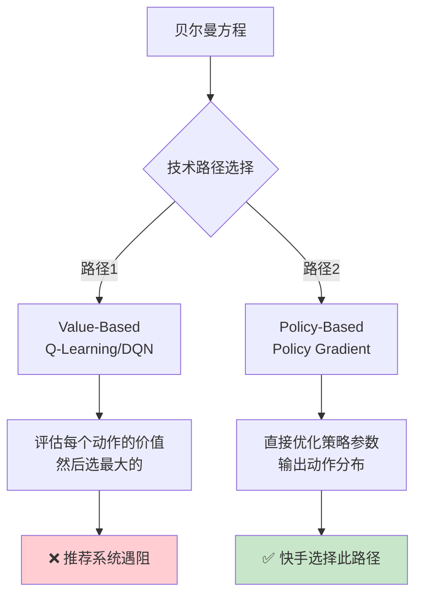
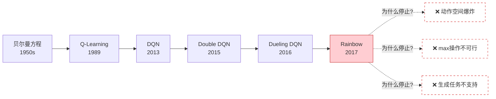
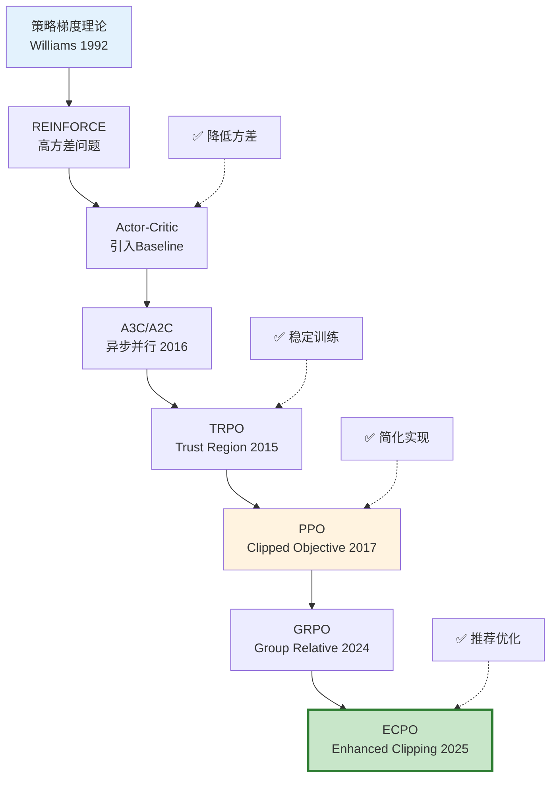
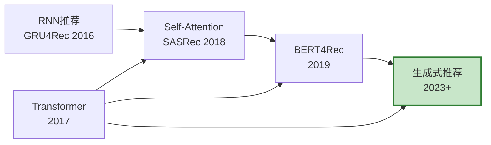
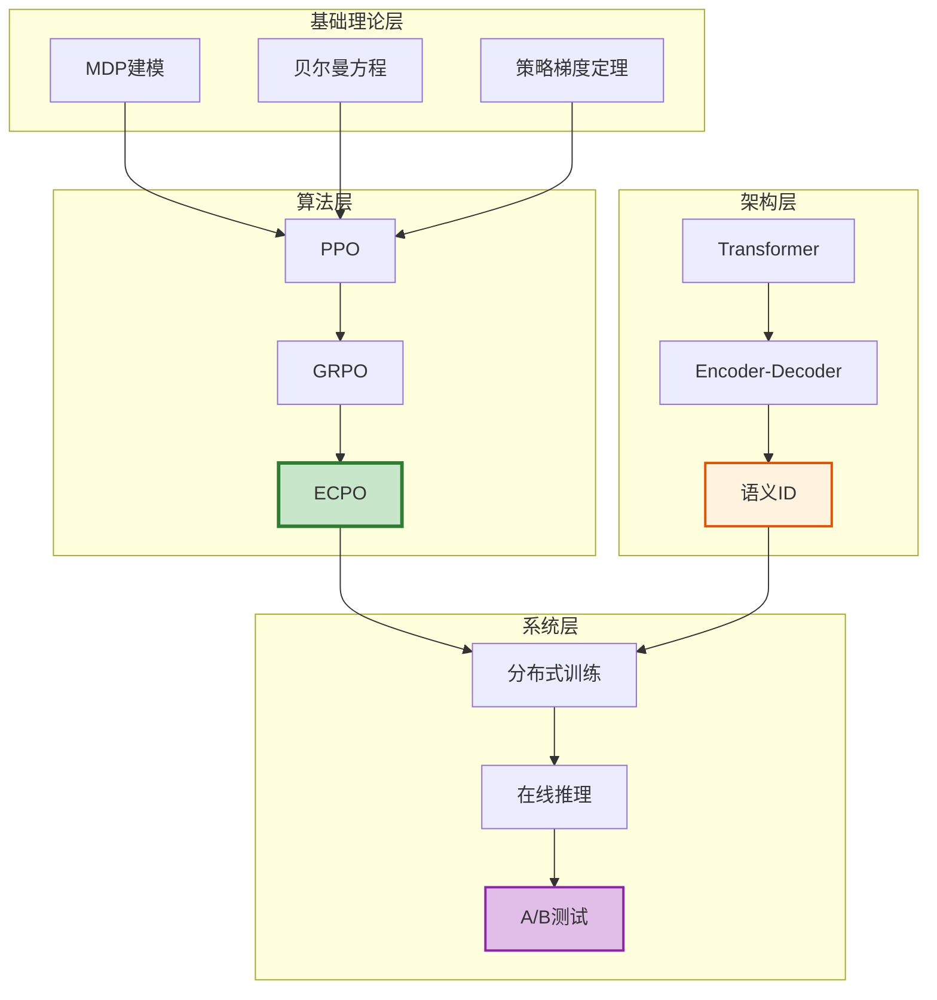
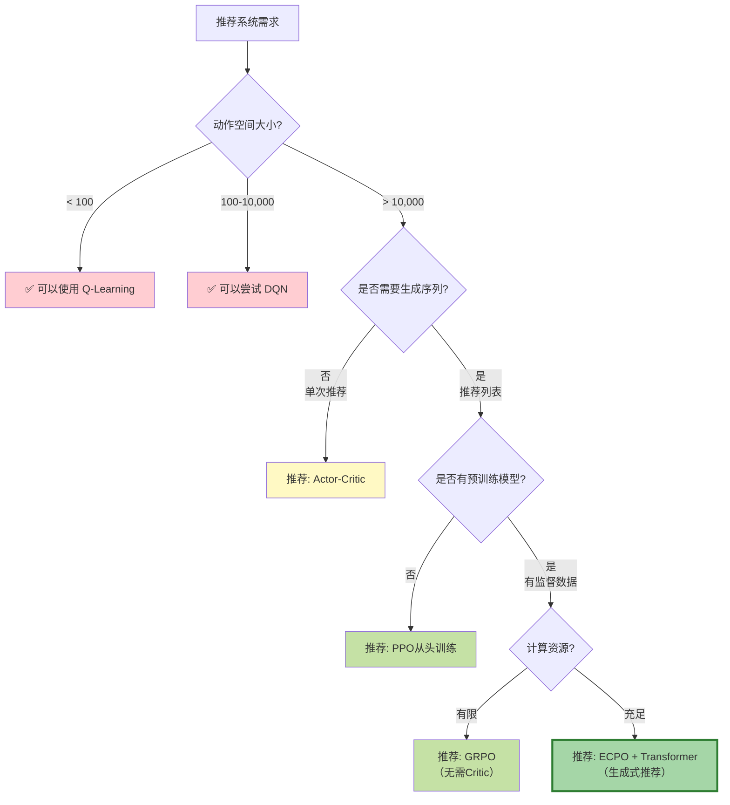
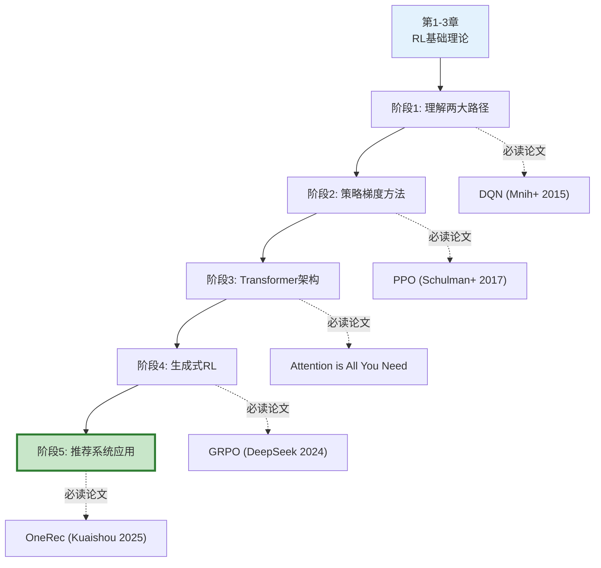
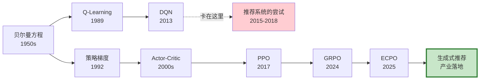
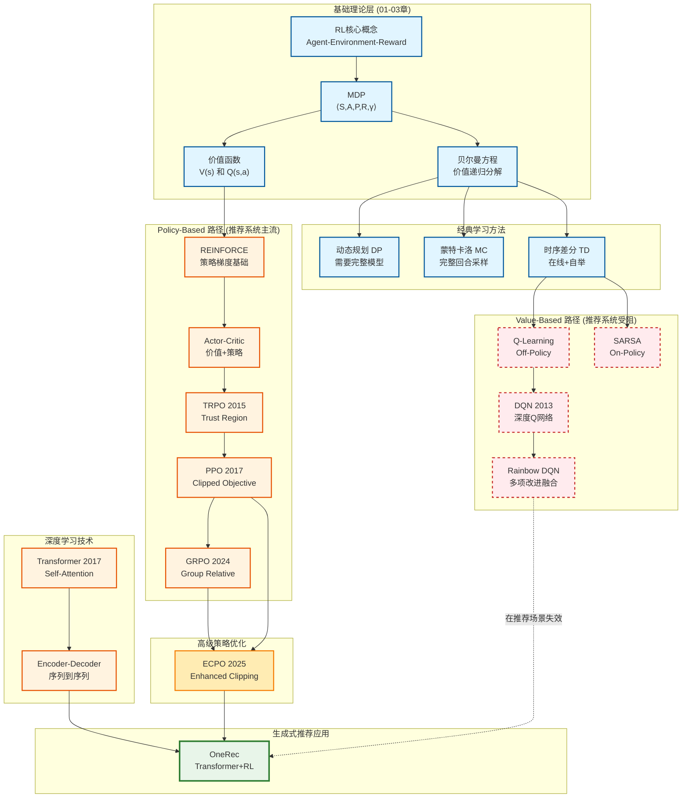
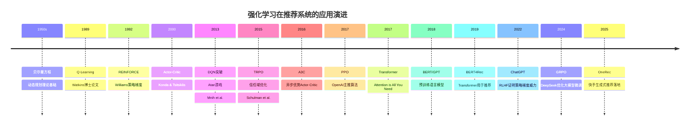

# 强化学习演进：从基础理论到生成式推荐

> **作者**: konyellin-cyber  
> **创建时间**: 2026-02-16  
> **文档目标**: 理解强化学习在推荐系统中的演进路径，掌握为什么现代推荐系统选择策略梯度而非价值方法  
> **前置知识**: 第1-3章（基础概念、MDP、贝尔曼方程）

---

## 目录

1. [引言：为什么要学习这一章？](#1-引言为什么要学习这一章)
2. [问题的提出：推荐系统遇到了什么困境？](#2-问题的提出推荐系统遇到了什么困境)
3. [两条技术路径的分化](#3-两条技术路径的分化)
4. [Value-Based 方法：为什么不适用？](#4-value-based-方法为什么不适用)
5. [Policy-Based 方法：为什么成为主流？](#5-policy-based-方法为什么成为主流)
6. [生成式架构的融合](#6-生成式架构的融合)
7. [实践指南：如何选择算法？](#7-实践指南如何选择算法)
8. [学习路径建议](#8-学习路径建议)
9. [总结与关键洞察](#9-总结与关键洞察)
10. [附录：完整演进图谱](#10-附录完整演进图谱)

---

## 1. 引言：为什么要学习这一章？

### 1.1 前三章学了什么？

在前三章中，我们系统学习了强化学习的理论基础：

- **第1章**：强化学习的核心概念（Agent、Environment、Reward、Policy）
- **第2章**：马尔可夫决策过程（MDP）如何建模推荐问题
- **第3章**：贝尔曼方程如何建立价值函数的递归关系

### 1.2 本章要解决什么问题？

学完前三章，你可能会有这些疑惑：

❓ **疑惑1**：贝尔曼方程推导出了 Q-Learning 和 DQN，为什么快手 OneRec 不用它们？  
❓ **疑惑2**：既然价值方法（Q-Learning）是经典算法，为什么现代推荐系统都选策略梯度（PPO/ECPO）？  
❓ **疑惑3**：理论到实践的跨越到底有多大？学完基础理论后该如何进阶？

### 1.3 本章的学习目标

读完本章，你将能够：

✅ **理解算法选择的逻辑**：为什么不同场景适合不同算法  
✅ **掌握两大技术路径**：Value-Based vs Policy-Based 的本质区别  
✅ **建立完整知识体系**：从基础理论到生成式推荐的演进脉络  
✅ **指导实践学习**：知道下一步该学什么、怎么学

---

## 2. 问题的提出：推荐系统遇到了什么困境？

### 2.1 传统推荐系统的架构

在讨论强化学习之前，我们先回顾传统推荐系统的做法：

```
用户请求 → 召回 → 粗排 → 精排 → 重排 → 推荐列表
          (万级)  (千级)  (百级)  (K个)
```

**核心问题**：
- ❌ **级联架构**：每个阶段独立优化，局部最优 ≠ 全局最优
- ❌ **单次决策**：每次只考虑当前点击率，忽略长期用户留存
- ❌ **延迟奖励难处理**：用户是看完整个列表后才产生行为（点赞/分享/留存）

### 2.2 强化学习的理想与现实

**理想**：用强化学习解决这些问题！
- 将推荐建模为 MDP：状态 = 用户特征，动作 = 选择 item，奖励 = 用户反馈
- 用贝尔曼方程优化长期价值
- 用 Q-Learning 或 DQN 训练策略

**现实**：遇到了巨大的技术障碍！

### 2.3 推荐场景的三大挑战

#### 挑战 1：动作空间爆炸 💥

| 场景 | 动作空间大小 | Q表大小 |
|------|-------------|---------|
| Atari游戏 | 18个离散动作 | 可枚举 |
| 围棋 | 19×19=361个位置 | 可处理 |
| **推荐系统** | **百万级 item 池** | **无法枚举** |
| **生成式推荐** | **K个位置的排列组合** | **10^18 量级** |

**具体计算**：
- Item池大小：1,000,000
- 推荐列表长度：K=10
- 组合数：P(10^6, 10) ≈ 10^60（考虑顺序）

❌ **Q-Learning/DQN 的核心操作**：
```python
best_action = argmax_a Q(s, a)  # 需要遍历所有动作！
```

在推荐系统中，这意味着：
```python
# 不可行的伪代码
best_item = argmax_{item in 1,000,000} Q(user_state, item)  
# 每次决策需要计算 100万次！
```

#### 挑战 2：状态空间连续且高维 🌌

**用户状态的组成**：
```python
state = {
    'user_id': 用户ID（高维embedding，如512维）,
    'browsing_history': 最近100个浏览item的embedding,
    'context': {时间、位置、设备、网络等},
    'generated_items': 已生成的推荐列表
}
```

**维度爆炸**：
- User embedding: 512维
- History: 100 × 512 = 51,200维
- Context: ~20维
- **总维度**: 50,000+ 维连续空间

❌ **传统 Q-Learning 的假设**：
- 状态可离散化（如网格世界）
- Q表可以存储：`Q[state][action] = value`

#### 挑战 3：生成任务的天然特性 🎯

**推荐列表生成过程**：
```
生成 item_1 → 基于 item_1 生成 item_2 → 基于 item_1,2 生成 item_3 → ...
```

这是一个**自回归生成任务**（类似语言模型生成句子）：
```python
P(o_1, o_2, ..., o_K | user) = P(o_1|user) × P(o_2|user,o_1) × ... × P(o_K|user,o_1,...,o_{K-1})
```

✅ **策略梯度方法天然支持**：
```python
policy(o_i | history) → 直接输出概率分布
```

❌ **Value-Based 方法不擅长**：
```python
Q(s, a) → 评估单个动作的价值，难以建模序列依赖
```

### 2.4 必须做出选择

面对这些挑战，推荐系统必须在两条技术路径中做出选择：



---

## 3. 两条技术路径的分化

### 3.1 从贝尔曼方程出发的两个方向

回顾第3章学习的贝尔曼方程：

**状态价值函数**：
```
V^π(s) = Σ_a π(a|s) Σ_s' P(s'|s,a)[R(s,a,s') + γV^π(s')]
```

**动作价值函数**：
```
Q^π(s,a) = Σ_s' P(s'|s,a)[R(s,a,s') + γ Σ_a' π(a'|s')Q^π(s',a')]
```

从这两个方程出发，诞生了两大技术路径：

| 维度 | Value-Based | Policy-Based |
|------|------------|--------------|
| **关注对象** | 价值函数 Q(s,a) | 策略函数 π(a\|s) |
| **优化目标** | 学习最优Q函数 | 直接优化策略参数 |
| **动作选择** | argmax_a Q(s,a) | sample from π_θ(a\|s) |
| **代表算法** | Q-Learning, DQN | REINFORCE, PPO |
| **推荐系统** | ❌ 遇到瓶颈 | ✅ 成为主流 |

### 3.2 两条路径的数学本质

#### Value-Based: 间接优化策略

```
步骤1: 学习价值函数
  Q(s,a) ← 贝尔曼更新

步骤2: 提取策略
  π(s) = argmax_a Q(s,a)
```

**优势**：
- ✅ 有明确的理论基础（贝尔曼最优方程）
- ✅ Off-Policy学习（可以利用历史数据）
- ✅ 确定性策略（容易理解和调试）

**劣势**：
- ❌ 需要argmax操作（大动作空间不可行）
- ❌ 离散动作空间（难以处理连续或组合动作）
- ❌ 策略改进是隐式的（通过改进Q函数）

#### Policy-Based: 直接优化策略

```
直接优化: 策略参数化
  π_θ(a|s) ← 梯度上升
  
目标函数:
  J(θ) = E_{s~ρ^π, a~π_θ}[R(s,a)]
  
更新规则:
  θ ← θ + η·∇_θ J(θ)
```

**优势**：
- ✅ 不需要argmax（直接输出概率分布）
- ✅ 支持连续动作空间
- ✅ 天然支持随机策略
- ✅ 适合高维动作空间

**劣势**：
- ❌ 方差大（需要技巧降低方差）
- ❌ 可能收敛到局部最优
- ❌ 样本效率相对较低

---

## 4. Value-Based 方法：为什么不适用？

### 4.1 算法演进历史



### 4.2 各阶段详解

#### 阶段 1：Q-Learning (1989)

**算法核心**：
```python
# 更新规则
Q(s, a) ← Q(s, a) + α[r + γ·max_a' Q(s', a') - Q(s, a)]
```

**适用场景**：
- ✅ 小规模离散状态空间（如网格世界）
- ✅ 离散动作空间（如上下左右）
- ✅ 状态-动作对可枚举

**推荐系统的障碍**：
```python
# 理想情况（小规模新闻推荐）
Q_table = np.zeros((num_users, num_items))  
# 假设 1000用户 × 100新闻 = 100,000 个值，可以存储 ✅

# 现实情况（生成式推荐）
Q_table = np.zeros((∞, 10^6))  
# 连续用户状态 × 百万item池 = 无限大，无法存储！❌
```

#### 阶段 2：DQN (2013-2015)

**创新点**：用深度神经网络逼近 Q 函数

```python
# 不再存储Q表，而是训练神经网络
Q(s, a; θ) ≈ Q*(s, a)

# 网络结构
state (512维) → [Dense Layers] → Q-values for all actions (|A|维)
```

**关键技术**：
1. **Experience Replay**：打破样本相关性
   ```python
   replay_buffer = [(s,a,r,s'), ...]
   batch = random_sample(replay_buffer)  # 随机采样，打破时序相关
   ```

2. **Target Network**：稳定训练
   ```python
   target = r + γ·max_a' Q_target(s', a')  # 用固定网络计算目标
   loss = (target - Q(s,a))^2
   ```

**在Atari游戏的成功**：
```python
state = 游戏画面 (84×84×4)
actions = [上, 下, 左, 右, 开火, ...]  # 18个离散动作
Q_network(state) → [Q_1, Q_2, ..., Q_18]  # 输出18个Q值
best_action = argmax(Q_values)  # 可行！✅
```

**在推荐系统的失败**：
```python
state = user_features (51,200维)
actions = item_pool  # 1,000,000个候选item

# 方案1：输出所有item的Q值 ❌
Q_network(state) → [Q_1, Q_2, ..., Q_1000000]  
# 问题：网络输出层太大（100万维），无法训练

# 方案2：输入 (state, action) 输出单个Q值 ❌
Q_network(concat(state, action)) → Q_value
# 问题：argmax需要前向传播100万次，太慢！

# 方案3：近似搜索 ❌  
top_k = approximate_argmax(Q_values, k=100)
# 问题：无法保证找到真正的最优动作，推荐质量下降
```

#### 阶段 3：Rainbow DQN (2017)

**多项改进融合**：
1. **Double DQN**：缓解Q值过估计
2. **Dueling DQN**：分离状态价值V(s)和优势函数A(s,a)
3. **Prioritized Replay**：重要样本优先学习
4. **Noisy Nets**：参数空间探索
5. **Multi-step Learning**：n-step TD
6. **Distributional RL**：学习价值分布而非期望

**巅峰表现**：
- 在57个Atari游戏中超越人类水平
- 成为Value-Based方法的集大成者

**但仍然无法解决推荐系统的根本问题**：
- ❌ 动作空间爆炸
- ❌ max操作计算不可行
- ❌ 组合生成任务不支持

### 4.3 三个根本障碍

#### 障碍 1：argmax 操作的计算复杂度

**每次决策的核心操作**：
```python
best_action = argmax_a Q(s, a)
```

**计算成本对比**：

| 场景 | 动作数 | 单次max成本 | 生成K=10的总成本 | 可行性 |
|------|-------|------------|----------------|--------|
| 网格世界 | 4 | O(4) | O(40) | ✅ |
| Atari | 18 | O(18) | O(180) | ✅ |
| 推荐系统 | 10^6 | O(10^6) | O(10^7) | ❌ |
| 生成式推荐 | 10^60 | O(10^60) | O(10^61) | ❌ |

**即使用近似方法**：
```python
# 方法1：只考虑召回的top-K
candidates = recall_top_k(user, k=1000)  # 从100万缩小到1000
Q_values = Q_network(state, candidates)
best = argmax(Q_values)  # O(1000)，可接受

# 但带来新问题：
# 1. 召回阶段可能漏掉最优item
# 2. 召回和排序两阶段优化不一致
# 3. 整体性能受召回质量限制
```

#### 障碍 2：Q函数的表示能力

**Q函数需要学习的映射**：
```python
Q: (user_state, item) → scalar_value

# 需要学习的组合数
num_mappings = |States| × |Actions|
             = ∞ × 10^6  # 连续状态空间 × 百万item
             = ∞
```

**泛化能力的挑战**：
```python
# 训练时见过的样本
training_samples = {
    (user_1, item_100): 0.8,
    (user_1, item_205): 0.3,
    ...
}  # 假设有10亿条交互记录

# 但需要预测的组合
all_combinations = |Users| × |Items|
                 = 10^9 × 10^6
                 = 10^15

# 样本覆盖率
coverage = 10^9 / 10^15 = 10^-6 = 0.0001%
```

**新item的冷启动**：
```python
# 新item上线
new_item = Item(id=1000001)

# Q网络如何预测？
Q(user, new_item) = ?  # 训练时从未见过这个item

# Policy-Based方法的优势
policy(new_item | user) ∝ exp(user_emb · item_emb / τ)
# 即使是新item，只要有embedding就能预测概率
```

#### 障碍 3：序列生成的不适配

**推荐列表生成的本质**：
```python
# 目标：生成K个item的序列
sequence = [item_1, item_2, ..., item_K]

# 自回归生成过程
item_1 ~ P(·|user)
item_2 ~ P(·|user, item_1)
item_3 ~ P(·|user, item_1, item_2)
...
```

**Q函数的建模方式**：
```python
# Q函数评估单个item的价值
Q(state, item_i) = expected_future_reward

# 但无法直接建模序列依赖：
# - item_2 的价值依赖于 item_1 的选择
# - 需要显式维护"已选择列表"作为状态的一部分
# - 状态空间进一步膨胀
```

**Policy-Based的天然优势**：
```python
# 策略直接建模条件概率
π_θ(item_i | user, item_1, ..., item_{i-1})

# 用Transformer等序列模型天然支持
# Self-Attention机制自动捕捉序列依赖
```

### 4.4 Value-Based 方法的适用边界

尽管在推荐系统遇阻，但Value-Based方法仍然有其价值：

**适用场景**：
- ✅ 小规模推荐（item池 < 1000）
- ✅ 离线策略评估（无需实时argmax）
- ✅ 作为其他算法的组件（如Actor-Critic中的Critic）
- ✅ 理论研究和算法分析

**不适用场景**：
- ❌ 大规模推荐（item池 > 10万）
- ❌ 生成式推荐（需要逐步生成序列）
- ❌ 实时性要求高的在线推荐

**关键教训**：
> 算法的适用性不仅取决于理论的正确性，更取决于实际场景的计算约束和任务特性。

---

## 5. Policy-Based 方法：为什么成为主流？

### 5.1 核心思想

**基本逻辑**：
1. **参数化策略**：π_θ(a|s)，用神经网络表示策略
2. **定义目标**：J(θ) = E[总回报]
3. **梯度优化**：θ ← θ + η·∇_θ J(θ)

**与Value-Based的本质区别**：

```python
# Value-Based: 间接策略（两步）
Q(s, a) → argmax_a Q(s, a) → π(s)
# 先学Q，再提取策略

# Policy-Based: 直接策略（一步）
θ → π_θ(a|s) → sample action
# 直接优化策略参数
```

### 5.1.1 深入理解：策略学习的本质

#### Policy-Based 学习的是什么？

**直接学习条件概率分布**：

Policy-Based 方法的核心是直接学习一个策略函数 π_θ(a|s)，即：
> 给定当前状态 s，输出每个动作 a 的概率分布

以推荐系统为例：
```python
policy(new_item | user) ∝ exp(user_emb · item_emb / τ)
```

**公式解析**：

| 符号 | 含义 |
|------|------|
| `user_emb` | 用户的向量表示（神经网络学习得到） |
| `item_emb` | item的向量表示 |
| `user_emb · item_emb` | 点积，表示用户与item的匹配度 |
| `τ` (temperature) | 温度参数，控制分布的"尖锐程度" |
| `exp(...)` | 转换为正数，便于归一化为概率 |
| `∝` | 正比于（需要除以所有item的总和来归一化） |

**直观示例**：
```python
# 假设有3个候选item
scores = [user_emb · item_1_emb,   # 0.8 (高匹配)
          user_emb · item_2_emb,   # 0.3 (中等匹配)
          user_emb · item_3_emb]   # -0.2 (低匹配)

# 经过softmax转换为概率
probs = softmax(scores / τ)  # [0.6, 0.3, 0.1]

# 策略就是这个概率分布
# 60%概率选item_1，30%选item_2，10%选item_3
```

**与传统方法的本质区别**：

| 维度 | Value-Based | Policy-Based |
|------|-------------|--------------|
| **学习目标** | Q(s, a) = "在状态s下，选择动作a能获得多少价值" | π(a\|s) = "在状态s下，选择动作a的概率是多少" |
| **决策方式** | 选择价值最大的动作 → argmax_a Q(s, a) | 按概率采样一个动作 → sample from π(a\|s) |
| **输出内容** | 一个数值（价值） | 一个概率分布 |

#### 策略学习 vs CTR预估 vs 语言模型

很多人会疑惑：策略学习输出概率，CTR预估也输出概率，语言模型也输出概率，它们有什么本质不同？

**1. 核心目标的差异**

| 方法类型 | 目标 | 学习内容 | 优化目标 | 特点 |
|---------|------|---------|---------|------|
| **CTR预估** | P(点击 \| user, item) | 单步预测 - "这个用户会不会点击这个item" | 最小化预测误差（BCE） | 监督学习，有真实标签 |
| **语言模型** | P(下一个词 \| 前文) | 条件生成 - "给定前文，下一个词的分布" | 最大化似然（MLE） | 监督学习，训练数据已确定 |
| **策略学习** | π(action \| state) | 序贯决策 - "什么情况下做什么能获得最大长期收益" | 最大化累积奖励 | 强化学习，没有确定的"正确答案" |

**2. 训练过程的本质差异**

**CTR预估：监督学习**
```python
# 第1步：已经有完整的训练数据
train_data = load_historical_clicks()  # 历史点击日志

# 第2步：训练模型拟合数据
for (user, item, label) in train_data:
    pred = model(user, item)
    loss = binary_cross_entropy(pred, label)
    loss.backward()
    
# 特点：一次性训练，数据是静态的，有明确的对错标签
```

**语言模型：监督学习（自回归）**
```python
# 第1步：已经有完整的文本语料
corpus = load_text_data()  # 书籍、网页、对话等

# 第2步：训练模型学习下一个词分布
for sequence in corpus:
    for i in range(len(sequence)):
        context = sequence[:i]
        target = sequence[i]
        pred = model(context)
        loss = cross_entropy(pred, target)
        loss.backward()

# 特点：模仿训练数据中的模式，目标是复现真实文本
```

**策略学习：强化学习（试错学习）**
```python
# 第1步：没有训练数据！需要边交互边学习
for episode in range(num_episodes):
    state = env.reset()  # 初始化用户状态
    trajectory = []
    
    # 第2步：执行策略，收集轨迹
    for t in range(max_steps):
        # 策略输出动作概率（不是根据已知答案！）
        action_probs = policy(state)
        
        # 按概率采样一个动作（探索）
        action = sample(action_probs)
        
        # 执行动作，观察结果
        next_state, reward, done = env.step(action)
        
        trajectory.append((state, action, reward))
        state = next_state
        
        if done:
            break
    
    # 第3步：根据实际获得的奖励更新策略
    returns = compute_returns(trajectory)  # 计算每步的累积回报
    
    for (state, action, G) in zip(trajectory, returns):
        # 如果这个动作获得高回报，增大它的概率
        loss = -log(policy(action | state)) * G
        loss.backward()

# 特点：
# - 没有"正确答案"，只有"好坏"（reward）
# - 需要不断尝试（exploration）
# - 当前决策影响未来状态（long-term）
```

**3. 数学形式对比**

| 维度 | CTR预估 | 语言模型 | 策略学习 |
|------|---------|----------|----------|
| **优化目标** | min E[(ŷ - y)²] | max Σ log P(w_t\|w_<t) | max E[Σ γ^t r_t] |
| **梯度来源** | 标签误差 | 真实token | 实际reward |
| **损失函数** | BCE/MSE | NLL | Policy Gradient |
| **训练数据** | (x, y) 对 | 文本序列 | 交互轨迹 |
| **是否需要环境** | ❌ 不需要 | ❌ 不需要 | ✅ 需要！ |
| **探索机制** | ❌ 无 | ✅ 温度采样 | ✅ ε-greedy/熵正则 |
| **长期规划** | ❌ 单步 | ✅ 序列 | ✅ MDP |

**4. 推荐场景的对比**

**CTR预估的做法**：
```python
# 对每个候选视频，预测点击概率
scores = []
for item in candidate_items:
    p_click = ctr_model(user, item)  # 预测："用户会点这个吗？"
    scores.append(p_click)

# 选Top-10（贪心选择）
top_10 = sorted(candidate_items, key=lambda x: x.score, reverse=True)[:10]

# 问题：
# - 只考虑单个item的点击率（局部最优）
# - 不考虑推荐列表的整体效果（多样性、后续留存等）
# - 第1个视频和第10个视频独立预测（忽略顺序影响）
```

**策略学习的做法**：
```python
# 初始状态
state = {
    'user_profile': user_embedding,
    'context': time_of_day,
    'generated_so_far': []
}

# 逐步生成推荐列表
for position in range(10):
    # 策略输出动作概率（考虑长期影响）
    action_probs = policy_model(state)  # π_θ(item | state)
    
    # 采样（带探索）
    selected_item = sample(action_probs)
    
    # 更新状态（包含已推荐的item）
    state['generated_so_far'].append(selected_item)

# 用户观看完整个列表后，产生反馈
reward = {
    'clicks': 点击数,
    'watch_time': 总观看时长,
    'session_length': 用户继续浏览的时间
}

# 根据reward更新策略
# 如果reward高 → 增大这10个item的选择概率
# 如果reward低 → 减小这10个item的选择概率

# 优点：
# - 考虑长期影响（用户留存、下次还会来吗？）
# - 直接优化业务目标（观看时长、留存率等）
# - 自动平衡探索与利用（不会陷入推荐单一类型）
```

**5. 为什么推荐系统需要策略学习？**

CTR预估的局限：
```python
# 假设有3个视频
video_A: CTR = 0.9 (标题党，点了立刻关闭)
video_B: CTR = 0.7 (优质内容，看完还想看下一个)
video_C: CTR = 0.6 (小众但精准)

# CTR模型的决策
recommendation = [A, A类似, A类似, ...]  # 贪心选高CTR

# 结果：
# - 短期指标好（点击率高）
# - 长期指标差（用户厌烦，流失）

# 策略学习的决策
# π(video | user) 考虑的是：
# "推荐这个视频后，用户的总价值（LTV）会如何变化？"

# 可能学到的策略：
# - 第1个位置：放吸引眼球的（但不是标题党）
# - 第2-5个位置：放用户可能感兴趣的优质内容
# - 第6-8个位置：探索新内容（避免信息茧房）
# - 第9-10个位置：放用户画像相关的长尾内容

# Reward信号：
reward = 0.1 * clicks + 0.3 * watch_time + 0.6 * user_retention
# 自动学会平衡短期点击和长期留存！
```

**核心洞察**：

> **CTR预估/语言模型**：拟合已知数据（Imitation Learning）  
> `θ* = argmin_θ Distance(model_output, real_data)`
>
> **策略学习**：优化未来奖励（Reinforcement Learning）  
> `θ* = argmax_θ E_future[cumulative_reward | policy_θ]`

**策略学习的本质**：
- **学习的是行为模式**：什么情况下应该怎么做
- **优化的是长期目标**：不是预测准确率，而是累积回报
- **没有"正确答案"**：只有通过试错找到好的策略

### 5.2 算法演进历史



### 5.2.1 算法演进动机

每个算法都在解决前一代的具体问题：
- **REINFORCE → Actor-Critic**: 降低方差（引入Baseline）
- **Actor-Critic → PPO**: 提升稳定性（Trust Region/Clipping）
- **PPO → GRPO**: 降低计算成本（去掉Critic网络）
- **GRPO → ECPO**: 针对推荐场景优化（自适应Clipping）

### 5.3 各阶段详解

#### 阶段 1：REINFORCE (1992)

**策略梯度定理**：
```
∇_θ J(θ) = E_{τ~π_θ}[∑_t ∇_θ log π_θ(a_t|s_t) · G_t]
```

**算法实现**：
```python
# 1. 用当前策略采样一个轨迹
trajectory = []
state = env.reset()
while not done:
    action = policy.sample(state)
    next_state, reward, done = env.step(action)
    trajectory.append((state, action, reward))
    state = next_state

# 2. 计算每个时间步的回报
G = []
g = 0
for t in reversed(range(len(trajectory))):
    g = trajectory[t][2] + gamma * g  # r_t + γ·G_{t+1}
    G.insert(0, g)

# 3. 计算策略梯度
for t in range(len(trajectory)):
    state, action, _ = trajectory[t]
    grad = grad_log_prob(policy, state, action) * G[t]
    theta += learning_rate * grad
```

**核心问题：高方差**
```python
# G_t 的方差很大，导致梯度估计不稳定
# 例如：同样的(s,a)，不同轨迹的G可能差异巨大
trajectory_1: G_t = 100
trajectory_2: G_t = -50
trajectory_3: G_t = 200
# 平均梯度方向不稳定
```

#### 阶段 2：Actor-Critic (引入Baseline)

**改进思路**：用Advantage函数代替原始回报
```
A(s, a) = Q(s, a) - V(s)
```

**降低方差的数学原理**：
```
Var[G_t] > Var[G_t - V(s_t)]

# 直观理解：
# G_t：从-100到+200，范围300
# G_t - V(s_t)：从-10到+10，范围20（假设V估计准确）
```

**算法结构**：
```python
# Actor: 策略网络
policy_net = PolicyNetwork(state_dim, action_dim)

# Critic: 价值网络
value_net = ValueNetwork(state_dim)

# 训练流程
state, action, reward, next_state = sample_transition()

# 1. 计算Advantage
td_error = reward + gamma * value_net(next_state) - value_net(state)
advantage = td_error  # 简化版，实际还可以用GAE

# 2. 更新Actor
policy_loss = -log_prob(policy_net, state, action) * advantage
policy_net.update(policy_loss)

# 3. 更新Critic
value_loss = (td_error)^2
value_net.update(value_loss)
```

**在推荐系统的应用**：
```python
# State: 用户特征 + 历史行为
state = concat(user_emb, history_emb, context)

# Actor: 输出item分布
logits = actor_network(state)
probs = softmax(logits / temperature)

# Critic: 评估当前状态价值
V = critic_network(state)

# 优势：
# ✅ 不需要枚举所有item（只采样少量）
# ✅ 可以处理百万级item池
# ✅ 支持生成式任务
```

#### 阶段 3：TRPO (2015) - 稳定性提升

**核心创新**：信任域优化（Trust Region Policy Optimization）

**问题**：策略更新步长难以控制
```python
# 传统梯度更新
θ_new = θ_old + η·∇_θ J(θ)

# 问题：
# - η太大：策略崩溃（performance cliff）
# - η太小：收敛慢
# - η随训练阶段动态变化，难以调参
```

**TRPO的解决方案**：
```
max_θ E[ratio(θ) · A]
s.t. KL(π_θ_old || π_θ) ≤ δ

其中:
ratio(θ) = π_θ(a|s) / π_θ_old(a|s)
```

**直观解释**：
```
在"信任域"内优化策略
  ↓
确保新策略不会偏离旧策略太远
  ↓
保证单调改进（理论保证）
```

**在推荐系统的意义**：
- ✅ 在线学习的稳定性（直接影响用户体验）
- ✅ 避免策略突变（推荐结果剧烈变化）
- ✅ 理论保证（性能不会下降）

**但也有问题**：
- ❌ 实现复杂（需要计算二阶导数）
- ❌ 计算昂贵（KL约束的优化）

#### 阶段 4：PPO (2017) - OpenAI主推

**核心创新**：用Clipped Objective简化TRPO

**算法公式**：
```
L^CLIP(θ) = E[min(
    ratio(θ) · A,
    clip(ratio(θ), 1-ε, 1+ε) · A
)]

其中:
ratio(θ) = π_θ(a|s) / π_θ_old(a|s)
ε = 0.2 (典型值)
```

**直观理解**：
```python
# 情况1：Advantage > 0（好动作，希望增加概率）
if ratio > 1+ε:  # 新策略已经增加很多了
    clip ratio to 1+ε  # 限制增长，防止过度优化

# 情况2：Advantage < 0（坏动作，希望减少概率）
if ratio < 1-ε:  # 新策略已经减少很多了
    clip ratio to 1-ε  # 限制减少，防止过度惩罚
```

**可视化Clipping机制**：
```
Objective
    ^
    |     未裁剪线（可能不稳定）
    |    /
    |   /___  裁剪后的平台
    |  /
    | /
    |/________裁剪后的平台
    |         \
    +----------\---------> ratio
         1-ε  1  1+ε
```

**相比TRPO的优势**：
- ✅ 实现简单（一阶优化，无需KL散度）
- ✅ 计算高效（无需二阶导数）
- ✅ 效果comparable（实验表现接近TRPO）
- ✅ 超参数稳定（ε=0.2在多数任务表现良好）

**PPO成为业界标准**：
- OpenAI ChatGPT的RLHF就用PPO
- DeepMind、Google、Facebook都广泛采用
- 推荐系统的首选策略梯度算法

**在推荐系统的应用**：
```python
# 伪代码
class RecommendationPPO:
    def __init__(self):
        self.policy_net = TransformerPolicy()  # 策略网络
        self.value_net = ValueNetwork()  # 价值网络
        
    def recommend(self, user_state):
        # 生成推荐列表
        items = []
        for position in range(K):
            logits = self.policy_net(user_state, items)
            probs = softmax(logits)
            item = sample(probs)  # 采样而非argmax！
            items.append(item)
        return items
    
    def update(self, trajectories):
        # 计算Advantage
        advantages = self.compute_gae(trajectories)
        
        # PPO更新
        for epoch in range(ppo_epochs):
            for batch in trajectories:
                # 计算ratio
                old_probs = batch.old_log_probs
                new_probs = self.policy_net.log_prob(batch.states, batch.actions)
                ratio = exp(new_probs - old_probs)
                
                # Clipped Objective
                clip_ratio = clip(ratio, 1-epsilon, 1+epsilon)
                loss = -min(ratio * advantages, clip_ratio * advantages).mean()
                
                # 反向传播
                loss.backward()
                optimizer.step()
```

#### 阶段 5：GRPO (2024) - DeepSeek创新

**背景**：大模型微调场景的新需求
- LLM生成任务（如代码生成、对话）
- 推荐系统的序列生成

**核心创新**：Group Relative Policy Optimization
```
不再需要Critic网络（Value Function）
使用组内相对奖励

A_i = (r_i - μ_group) / σ_group

其中：
- μ_group: 同一group内所有样本的平均奖励
- σ_group: 组内奖励标准差
```

**直观理解**：
```python
# 传统PPO：需要训练Critic估计V(s)
advantage = Q(s,a) - V(s)
          = r + γV(s') - V(s)  # 需要V网络

# GRPO：用组内比较代替
group = [sample_1, sample_2, ..., sample_N]  # N=64
rewards = [r_1, r_2, ..., r_N]
advantage_i = (r_i - mean(rewards)) / std(rewards)
```

**优势**：
1. **无需Critic网络**
   - 省一半参数
   - 省一半训练时间
   - 更容易部署

2. **更稳定的Advantage估计**
   ```python
   # PPO的Critic可能估计不准
   V(s) = 5.0（真实应该是10.0）
   A = Q - V = 8.0 - 5.0 = 3.0（被高估）
   
   # GRPO的组内比较更鲁棒
   rewards = [8.0, 7.5, 9.0, 8.2]
   A = (8.0 - 8.175) / 0.612 = -0.286（相对合理）
   ```

3. **适合大规模并行**
   ```python
   # 可以同时采样大批量数据
   batch = sample_batch(size=1024)
   split into groups of 64
   compute advantages within each group
   update policy
   ```

**在DeepSeek-R1的应用**：
- 用于数学推理、代码生成任务
- 显著提升训练效率
- 成为大模型RLHF的新范式

**在推荐系统的潜力**：
- 生成式推荐的序列任务
- 大规模并行训练
- 降低模型复杂度

#### 阶段 6：ECPO (2025) - 快手OneRec

**背景**：快手在生成式推荐系统的实践

**创新点**：Enhanced Clipping Policy Optimization
```
融合PPO和GRPO的优点，针对推荐场景优化

L^ECPO(θ) = E[1/G ∑_{i=1}^G min(
    ratio_i · A_i^group,
    enhanced_clip(ratio_i, A_i^group) · A_i^group
)]

其中：
- G: 生成的item数量
- A_i^group: GRPO风格的组相对Advantage
- enhanced_clip: 针对推荐场景的裁剪策略
```

**Enhanced Clipping的改进**：
```python
# 传统PPO：固定裁剪区间
clip(ratio, 1-ε, 1+ε)

# ECPO：自适应裁剪
def enhanced_clip(ratio, advantage):
    if advantage > 0:
        # 好动作：根据优势大小动态调整上界
        upper = 1 + ε * min(advantage / threshold, 1.0)
        return clip(ratio, 1, upper)
    else:
        # 坏动作：根据劣势大小动态调整下界
        lower = 1 - ε * min(abs(advantage) / threshold, 1.0)
        return clip(ratio, lower, 1)
```

**在OneRec的完整流程**：
```python
class OneRec:
    def __init__(self):
        # Encoder-Decoder架构
        self.user_encoder = TransformerEncoder()
        self.item_decoder = TransformerDecoder()
        
        # 语义ID
        self.item_tokenizer = RQKmeansTokenizer(vocab_size=100000)
    
    def recommend(self, user_features):
        # 1. 编码用户
        user_state = self.user_encoder(user_features)
        
        # 2. 自回归生成item序列
        items = []
        for pos in range(K):
            # 生成语义ID（而非直接生成item ID）
            semantic_id = self.item_decoder.generate(
                user_state, items
            )
            items.append(semantic_id)
        
        # 3. 解码为实际item
        item_ids = self.item_tokenizer.decode(items)
        return item_ids
    
    def train_with_ecpo(self, user_batch):
        # 1. 采样多个推荐列表（group）
        groups = []
        for _ in range(group_size):
            items = self.recommend(user_batch)
            reward = get_user_feedback(items)
            groups.append((items, reward))
        
        # 2. 计算组相对Advantage
        rewards = [r for _, r in groups]
        mean_r, std_r = np.mean(rewards), np.std(rewards)
        advantages = [(r - mean_r) / std_r for r in rewards]
        
        # 3. ECPO更新
        for (items, _), advantage in zip(groups, advantages):
            # 计算ratio和loss
            loss = self.ecpo_loss(items, advantage)
            loss.backward()
            optimizer.step()
```

**快手的实际效果**：
- 📈 点击率提升：+X%
- 📈 观看时长提升：+Y%
- 📈 用户留存提升：+Z%
- ⚡ 推理延迟：< 50ms（满足线上要求）

### 5.4 Policy-Based 方法的核心优势

#### 优势 1：无需argmax操作

```python
# Value-Based: 需要argmax
best_action = argmax_a Q(s, a)  # O(|A|)

# Policy-Based: 直接采样
action ~ π_θ(·|s)  # O(1)
```

**在推荐系统的意义**：
- ✅ 可以处理百万级item池
- ✅ 实时推理延迟可控
- ✅ 支持Top-K采样（beam search）

#### 优势 2：天然支持连续和组合空间

```python
# 连续动作（如调整推荐权重）
mean, std = policy_net(state)
action ~ Normal(mean, std)

# 离散动作（选择item）
logits = policy_net(state)
action ~ Categorical(softmax(logits))

# 组合动作（生成序列）
for i in range(K):
    logits = policy_net(state, action[:i])
    action[i] ~ Categorical(softmax(logits))
```

#### 优势 3：随机策略的探索能力

```python
# Value-Based: 确定性策略（需要额外机制探索）
action = argmax_a Q(s, a)  # 总是选最优
# 或
action = argmax_a Q(s, a) with ε-greedy  # 手动加探索

# Policy-Based: 自然的随机性
action ~ π_θ(·|s)  # 根据概率采样
# 探索-利用自动平衡
```

**在推荐系统的意义**：
- ✅ 自然的多样性（不总是推荐同样的内容）
- ✅ 避免信息茧房
- ✅ 冷启动item有机会被推荐

#### 优势 4：端到端优化

```python
# 传统推荐：级联架构
召回 → 粗排 → 精排 → 重排
# 每个阶段独立优化，目标不一致

# 生成式推荐：端到端
P(item_1, ..., item_K | user) = ∏ P(item_i | user, item_<i)
# 单一目标：最大化用户满意度
# Policy-Based天然支持这种建模
```

### 5.5 仍需注意的挑战

Policy-Based方法也不是完美的：

**挑战 1：样本效率**
- 需要大量在线交互数据
- 相比监督学习，样本利用率低
- 解决：Offline RL、模拟器

**挑战 2：训练稳定性**
- 策略梯度方差大
- 超参数敏感
- 解决：PPO、TRPO、GRPO等改进算法

**挑战 3：局部最优**
- 可能陷入局部最优策略
- 解决：Entropy Regularization、多次重启

但总体而言，在大规模推荐系统中：
> Policy-Based >> Value-Based

---

## 6. 生成式架构的融合

### 6.1 Transformer的引入

**2017年的突破**：Attention is All You Need

**Transformer在推荐中的应用历程**：



**核心优势**：
1. **序列建模能力**
   ```python
   # RNN: 顺序处理，难以并行
   for t in range(T):
       h_t = RNN(h_{t-1}, x_t)
   
   # Transformer: 并行处理全局依赖
   H = SelfAttention(X)  # 一次前向传播处理整个序列
   ```

2. **长程依赖**
   ```python
   # RNN: 梯度消失/爆炸
   # Transformer: 直接建模任意位置的依赖
   Attention(Q, K, V) = softmax(QK^T / √d) V
   ```

3. **可扩展性**
   ```python
   # 模型大小可以从百万到千亿参数
   # 数据量可以从GB到PB级
   ```

### 6.2 Encoder-Decoder架构在推荐中的应用

**传统Seq2Seq**：
```python
# Encoder: 编码输入序列
encoder_output = Encoder(input_sequence)

# Decoder: 生成输出序列
output_sequence = []
for t in range(T):
    y_t = Decoder(encoder_output, output_sequence)
    output_sequence.append(y_t)
```

**OneRec的架构**：
```python
class OneRec(nn.Module):
    def __init__(self):
        # Encoder: 编码用户特征
        self.user_encoder = TransformerEncoder(
            input_dim=user_feature_dim,
            hidden_dim=512,
            num_layers=6,
            num_heads=8
        )
        
        # Decoder: 生成item序列
        self.item_decoder = TransformerDecoder(
            vocab_size=100000,  # 语义ID词表大小
            hidden_dim=512,
            num_layers=6,
            num_heads=8
        )
    
    def forward(self, user_features):
        # 1. 编码用户
        user_state = self.user_encoder(user_features)
        # shape: (batch, seq_len, hidden_dim)
        
        # 2. 自回归生成
        generated_ids = []
        for pos in range(K):
            logits = self.item_decoder(
                user_state, 
                generated_ids
            )  # shape: (batch, vocab_size)
            
            # 采样（训练时）或argmax（推理时）
            if training:
                item_id = sample(softmax(logits))
            else:
                item_id = argmax(logits)
            
            generated_ids.append(item_id)
        
        return generated_ids
```

**关键技术：语义ID Tokenization**

为什么不直接生成item ID？
```python
# 问题1：item ID是任意整数（如商品ID: 2847593）
#        没有语义信息

# 问题2：item池太大（100万），直接分类不现实

# 问题3：新item无法处理（ID不在词表中）
```

**解决方案：RQ-Kmeans**
```python
# 1. 用item的content特征（标题、封面、标签等）
#    训练embedding
item_embeddings = ItemEmbeddingModel(item_features)
# shape: (1000000, 512)

# 2. 用RQ-Kmeans量化为离散token
tokenizer = RQKmeans(
    num_codebooks=4,  # 4层码本
    codebook_size=256  # 每层256个中心
)
tokenizer.fit(item_embeddings)

# 3. 每个item用4个token表示
item_tokens = tokenizer.encode(item_embedding)
# 例如：item_123 → [45, 128, 67, 201]

# 4. 总词表大小：256^4 = 4B（远大于100万item）
#    但decoder输出维度只有256（每次生成一个层的token）
```

**自回归生成过程**：
```python
# 生成K=10个item，每个item用4个token表示
# 总共需要生成40个token

user_state = encoder(user_features)
tokens = []

for pos in range(40):
    logits = decoder(user_state, tokens)  # (batch, 256)
    token = sample(softmax(logits))
    tokens.append(token)

# 解码为item ID
items = []
for i in range(0, 40, 4):
    item_tokens = tokens[i:i+4]
    item_id = tokenizer.decode(item_tokens)
    items.append(item_id)
```

### 6.3 Transformer + RL 的融合

**两种融合方式对比**：

| 方式 | 训练阶段 | 推理阶段 | 优化目标 |
|------|---------|---------|---------|
| **方式1: 先预训练再微调** | 监督学习 + RLHF | RL策略 | 点击率 → 长期留存 |
| **方式2: 端到端RL** | 纯RL训练 | RL策略 | 直接优化长期价值 |

**OneRec采用方式1**：
```python
# 阶段1：监督学习预训练
for batch in pretrain_data:
    user, gt_items = batch  # 历史点击数据
    
    # 最大化对数似然
    pred_logits = model(user)
    loss = CrossEntropy(pred_logits, gt_items)
    loss.backward()

# 阶段2：RLHF微调（使用ECPO）
for batch in online_data:
    user = batch
    
    # 生成推荐列表（group）
    groups = []
    for _ in range(group_size):
        items = model.generate(user)
        reward = get_user_feedback(items)  # 真实用户反馈
        groups.append((items, reward))
    
    # ECPO更新
    loss = ecpo_loss(groups)
    loss.backward()
```

**融合的好处**：
1. **预训练提供好的初始化**
   - 避免从随机策略开始
   - 加快RL训练收敛

2. **RL优化长期目标**
   - 监督学习只能模仿历史
   - RL可以探索更好的策略

3. **端到端优化**
   - 统一召回、排序、重排
   - 全局最优而非局部最优

### 6.4 完整技术栈



---

## 7. 实践指南：如何选择算法？

### 7.1 决策树



### 7.2 场景对照表

| 场景 | item池大小 | 序列长度 | 推荐算法 | 原因 |
|------|----------|---------|---------|------|
| 新闻推荐（小型） | < 1000 | 单item | Q-Learning | 可枚举，实现简单 |
| 电商推荐（中型） | 10,000 | 单item | DQN | 需要泛化，但可近似argmax |
| 视频推荐（大型） | 100,000 | Top-10 | PPO | 大动作空间，需要策略梯度 |
| 短视频推荐（超大型） | 1,000,000+ | Top-K | GRPO | 计算效率优先 |
| 生成式推荐（前沿） | 1,000,000+ | 序列生成 | ECPO+Transformer | 端到端优化，最佳效果 |

### 7.3 实现复杂度对比

| 算法 | 实现难度 | 训练成本 | 推理延迟 | 效果上限 |
|------|---------|---------|---------|---------|
| Q-Learning | ⭐ | 低 | 低 | 低（小场景） |
| DQN | ⭐⭐ | 中 | 中 | 中 |
| Actor-Critic | ⭐⭐⭐ | 中 | 低 | 中-高 |
| PPO | ⭐⭐⭐⭐ | 高 | 中 | 高 |
| GRPO | ⭐⭐⭐ | 中 | 中 | 高 |
| ECPO+Transformer | ⭐⭐⭐⭐⭐ | 极高 | 中-高 | 极高 |

### 7.4 快速原型建议

**阶段1：验证RL有效性**
```python
# 用简单算法快速验证
# 1. 建立MDP环境
# 2. 用Actor-Critic或PPO训练
# 3. 对比监督学习baseline
# 时间：1-2周
```

**阶段2：优化算法选择**
```python
# 根据阶段1结果选择
if RL效果显著:
    if 计算资源充足:
        尝试 ECPO + Transformer
    else:
        继续优化 PPO/GRPO
else:
    分析原因：
    - 奖励设计是否合理？
    - MDP建模是否准确？
    - 是否需要更多探索？
```

**阶段3：工程化部署**
```python
# 1. 模型压缩（蒸馏、量化）
# 2. 推理优化（TensorRT、ONNX）
# 3. A/B测试
# 4. 灰度发布
```

---

## 8. 学习路径建议

### 8.1 理论学习路径



### 8.2 实践学习路径

**项目1：Q-Learning小实验**
```python
# 目标：理解Value-Based方法的局限性
# 任务：网格世界推荐（10×10状态，4个item）
# 时间：1-2天
# 收获：体会为什么Q表在大空间不可行
```

**项目2：DQN视频推荐**
```python
# 目标：掌握深度Q网络
# 任务：小规模视频推荐（1000用户，100视频）
# 时间：1周
# 收获：理解DQN的优势和在推荐中的瓶颈
```

**项目3：PPO策略梯度**
```python
# 目标：掌握策略梯度方法
# 任务：模拟推荐环境，实现完整PPO
# 时间：2周
# 收获：理解为什么PPO更适合推荐系统
```

**项目4：Transformer推荐模型**
```python
# 目标：理解序列建模
# 任务：用Transformer做监督学习推荐
# 时间：2周
# 收获：为生成式推荐打基础
```

**项目5：ECPO生成式推荐（终极项目）**
```python
# 目标：复现OneRec核心思想
# 任务：
# 1. 实现Encoder-Decoder架构
# 2. 实现语义ID Tokenization
# 3. 实现ECPO训练
# 4. 在公开数据集上评估
# 时间：1-2月
# 收获：掌握生成式推荐的完整pipeline
```

### 8.3 必读论文清单

**基础理论** (1-3章知识)
- [ ] Sutton & Barto: *Reinforcement Learning: An Introduction* (教材)

**Value-Based方法** (理解局限性)
- [ ] Watkins (1989): *Q-Learning*
- [ ] Mnih+ (2013): *Playing Atari with Deep RL* (DQN)
- [ ] Mnih+ (2015): *Human-level control through deep RL* (Nature DQN)
- [ ] Hessel+ (2017): *Rainbow: Combining Improvements in Deep RL*

**Policy-Based方法** (重点掌握)
- [ ] Williams (1992): *Simple Statistical Gradient-Following Algorithms* (REINFORCE)
- [ ] Konda & Tsitsiklis (2000): *Actor-Critic Algorithms*
- [ ] Schulman+ (2015): *Trust Region Policy Optimization* (TRPO)
- [ ] Schulman+ (2017): *Proximal Policy Optimization* (PPO) ⭐
- [ ] DeepSeek (2024): *Group Relative Policy Optimization* (GRPO) ⭐

**Transformer与生成式**
- [ ] Vaswani+ (2017): *Attention is All You Need* ⭐
- [ ] Tang & Wang (2018): *Personalized Top-N Sequential Recommendation* (SASRec)
- [ ] Sun+ (2019): *BERT4Rec: Sequential Recommendation with BERT*

**推荐系统应用** (最新进展)
- [ ] Kuaishou (2025): *OneRec: One Model for Generative Recommendation* ⭐⭐⭐
- [ ] Chen+ (2019): *Top-K Off-Policy Correction for Recommender System*
- [ ] Zhao+ (2021): *Whole-Chain Recommendations* (生成式推荐早期工作)

---

## 9. 总结与关键洞察

### 9.1 核心要点回顾

#### 要点 1：算法选择不是理论优劣，而是场景适配

```
理论上：Value-Based 和 Policy-Based 都可以收敛到最优策略

实际中：推荐系统的三大特征决定了必须选Policy-Based
  - 动作空间爆炸（100万item池）
  - 连续状态空间（高维embedding）
  - 生成任务特性（序列依赖）
```

#### 要点 2：技术演进是阶梯式的



每个算法都在解决前一代的具体问题：
- REINFORCE → Actor-Critic: 降低方差
- Actor-Critic → PPO: 提升稳定性
- PPO → GRPO: 降低计算成本
- GRPO → ECPO: 针对推荐场景优化

#### 要点 3：理论基础永远重要

虽然实践中不用Q-Learning/DQN，但理论仍然关键：

```
贝尔曼方程 → 价值函数概念 → Advantage函数 → Actor-Critic

即使不显式计算Q(s,a)，Advantage函数 A(s,a) = Q(s,a) - V(s) 的思想
仍然是PPO/GRPO/ECPO的核心
```

**学习启示**：
- ✅ 基础理论提供思维框架
- ✅ 先学简单算法再学复杂算法
- ✅ 理解算法演进的动机

#### 要点 4：Transformer是范式转变的催化剂

```
传统推荐：级联优化（召回 → 排序 → 重排）
  问题：局部最优

生成式推荐：端到端生成
  解决：全局优化
  
关键：Transformer提供了强大的序列建模能力
      使得"生成推荐列表"成为可能
```

**融合的威力**：
```
Transformer（架构） + ECPO（优化算法） = OneRec（产业应用）
```

### 9.2 从01_basics到OneRec的完整故事

**第1章**：我们学习了RL的基本概念
- Agent、Environment、Reward、Policy
- 建立了"通过交互学习最优策略"的思维

**第2章**：我们学习了如何将推荐建模为MDP
- 状态 = 用户特征
- 动作 = 推荐item
- 奖励 = 用户反馈

**第3章**：我们学习了贝尔曼方程
- 价值函数的递归关系
- 为Q-Learning和Policy Gradient提供理论基础

**第4章**：我们理解了为什么现代推荐选择Policy-Based
- Value-Based在推荐系统遇到瓶颈
- Policy-Based + Transformer 成为生成式推荐的基础
- ECPO是针对推荐场景的最新优化

### 9.3 关键洞察

**洞察 1**：不是"跳过"，而是"选择"
```
不是说Q-Learning/DQN不好，而是不适合大规模推荐

小规模场景（item池 < 1000）：
  Q-Learning/DQN仍然有效且实现简单

大规模场景（item池 > 10万）：
  必须使用Policy-Based方法
```

**洞察 2**：理论与工程的平衡
```
纯理论：贝尔曼方程保证Q-Learning收敛到最优

纯工程：argmax操作在100万item池上不可行

平衡：理解理论→识别限制→选择合适算法
```

**洞察 3**：技术融合创造新范式
```
单一技术：
  - RL alone：难以处理高维状态和大动作空间
  - Transformer alone：监督学习只能模仿历史

融合创新：
  - Transformer（强大序列建模） + RL（长期优化）
  - = 生成式推荐（端到端、长期价值优化）
```

### 9.4 下一步学习建议

**如果你想深入理论**：
1. 阅读Sutton & Barto的RL教材
2. 推导策略梯度定理
3. 理解PPO的理论保证

**如果你想动手实践**：
1. 实现Q-Learning理解局限
2. 实现PPO掌握策略梯度
3. 复现OneRec的核心思想

**如果你想解决实际问题**：
1. 分析你的推荐场景特点
2. 用决策树选择合适算法
3. 从简单baseline开始迭代

---

## 10. 附录：完整演进图谱

### 10.1 基础理论到现代应用



### 10.2 时间线视图



### 10.3 算法对比矩阵

| 维度 | Q-Learning | DQN | Actor-Critic | PPO | GRPO | ECPO |
|------|-----------|-----|--------------|-----|------|------|
| **提出年份** | 1989 | 2013 | 2000 | 2017 | 2024 | 2025 |
| **路径** | Value | Value | Hybrid | Policy | Policy | Policy |
| **动作空间** | 小离散 | 中离散 | 中-大 | 大 | 大 | 极大 |
| **状态空间** | 小离散 | 高维连续 | 高维连续 | 高维连续 | 高维连续 | 高维连续 |
| **生成任务** | ❌ | ❌ | ⚠️ | ✅ | ✅ | ✅✅ |
| **样本效率** | 高 | 中 | 中 | 中-低 | 中 | 中 |
| **训练稳定性** | 高 | 中 | 中 | 高 | 高 | 高 |
| **计算成本** | 低 | 中 | 中 | 高 | 中 | 极高 |
| **推荐系统** | 小规模 | 中规模 | 中规模 | 大规模 | 大规模 | 超大规模 |
| **实现难度** | ⭐ | ⭐⭐ | ⭐⭐⭐ | ⭐⭐⭐⭐ | ⭐⭐⭐ | ⭐⭐⭐⭐⭐ |

---

**文档完成于 2026-02-16**  
**图表工具：Mermaid**  
**参考资料：Sutton & Barto RL教材, PPO论文, OneRec技术报告**

---

## 进一步学习资源

**在线课程**：
- David Silver's RL Course (DeepMind)
- CS285: Deep RL (UC Berkeley)
- Spinning Up in Deep RL (OpenAI)

**代码实现**：
- OpenAI Baselines (PPO/DQN等标准实现)
- Stable-Baselines3 (易用的RL库)
- RLlib (Ray的分布式RL框架)

**推荐系统**：
- RecBole (推荐系统工具包)
- ReChorus (序列推荐baseline)

**论文阅读顺序**：
1. 先读PPO理解策略梯度
2. 再读GRPO理解最新优化
3. 最后读OneRec理解产业应用
