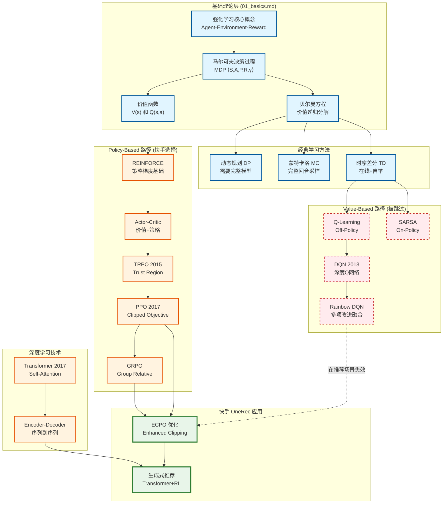
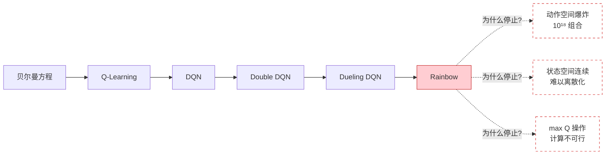
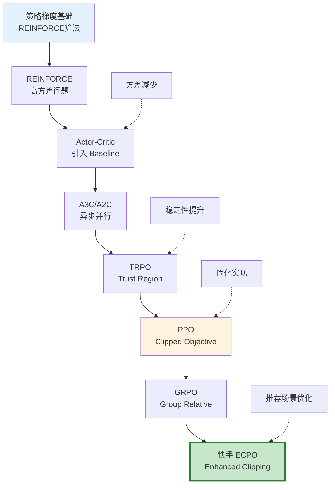
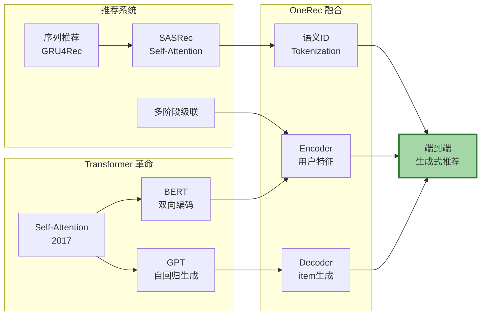
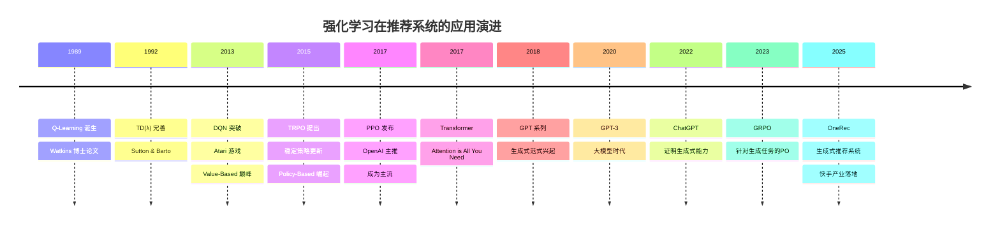
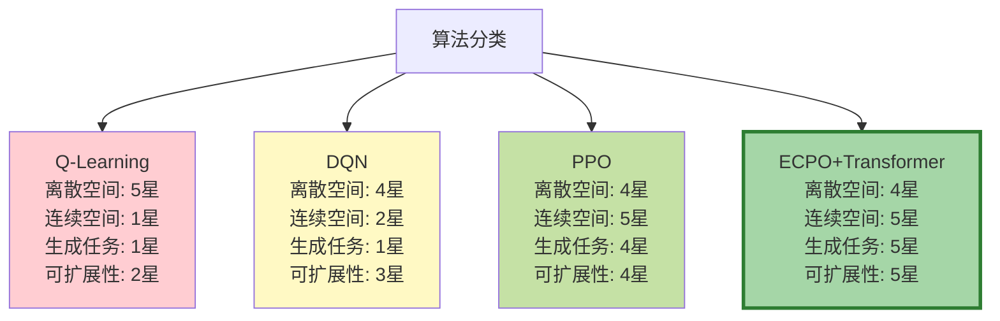
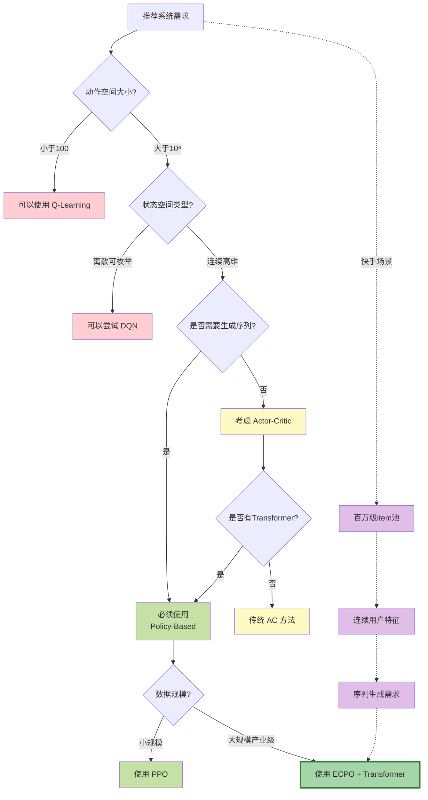
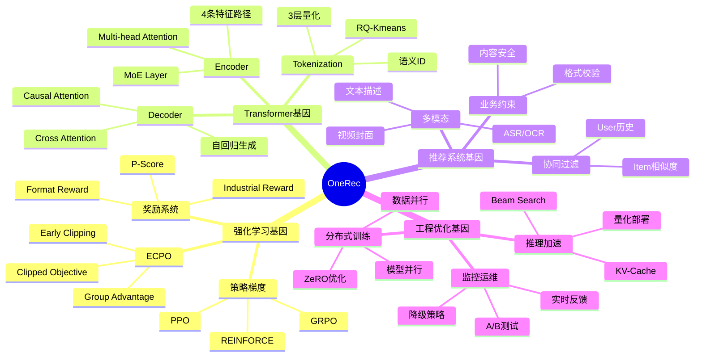
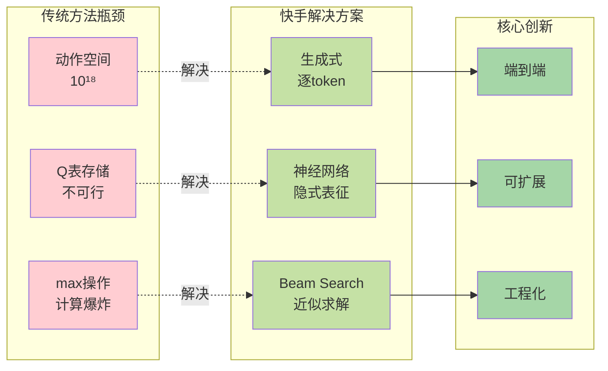
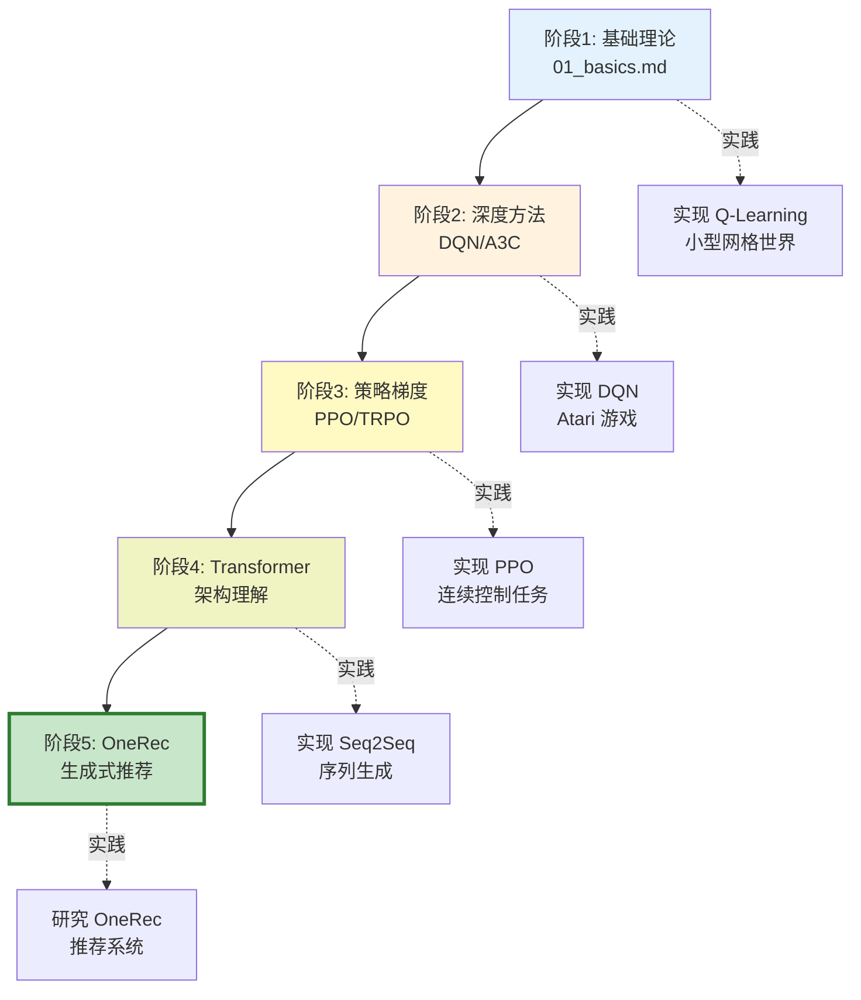

# 强化学习演进：从基础理论到快手 OneRec

本文档展示了强化学习从传统方法到现代生成式推荐系统的完整演进路径。

---

## 📊 强化学习基础演进关系图



---

## 🎯 三大演进路径详解

### 路径 1: Value-Based (被跳过的路径) ❌



**核心问题**：
- **Q表维度灾难**：`|States| × |Actions|` 在推荐场景中 → `∞ × 10^6`
- **max操作不可行**：需要遍历所有item组合
- **泛化能力弱**：未见过的 state-action 对无法处理

---

### 路径 2: Policy-Based (快手选择的路径) ✅



**核心优势**：
- ✅ **直接优化策略**：不需要 Q 函数
- ✅ **处理连续空间**：神经网络参数化策略
- ✅ **自然支持生成**：逐步生成动作序列

---

### 路径 3: 生成式架构融合 🚀



---

## 🔍 从 01_basics.md 到 OneRec 的跳跃式演进



---

## 📐 核心算法对比矩阵



---

## 🎓 为什么快手跳过 Value-Based？

### 决策树分析



---

## 🧬 OneRec 的技术基因图谱



---

## 📊 数学形式对比

### 传统 Value-Based (01_basics.md)

```
核心公式：
  V^π(s) = Σ_a π(a|s) Σ_s' P(s'|s,a)[R(s,a,s') + γV^π(s')]
  Q^π(s,a) = Σ_s' P(s'|s,a)[R(s,a,s') + γ Σ_a' π(a'|s')Q^π(s',a')]

更新规则（Q-Learning）：
  Q(s,a) ← Q(s,a) + α[r + γ·max_a' Q(s',a') - Q(s,a)]

策略提取：
  π(s) = argmax_a Q(s,a)
```

### 快手 ECPO (OneRec)

```
策略参数化：
  π_θ(o_1, o_2, ..., o_n | u) = ∏_{i=1}^n P_θ(o_i | u, o_1, ..., o_{i-1})

优化目标：
  J_ECPO(θ) = E_{u,{o_i}} [1/G ∑_{i=1}^G min(
    ratio(o_i) · A_i,
    clip(ratio(o_i), 1-ε, 1+ε) · A_i
  )]

其中：
  ratio(o_i) = π_θ(o_i|u) / π_θ_old(o_i|u)
  A_i = (r_i - μ_group) / σ_group  (GRPO: 无需V函数)

梯度更新：
  θ ← θ + η·∇_θ J_ECPO(θ)
```

---

## 🎯 关键突破点总结



---

## 📚 学习路径建议



---

## 🔄 范式转变总结

| 维度 | Value-Based (传统) | Policy-Based (快手) |
|------|-------------------|-------------------|
| **核心思想** | 先学价值，再提取策略 | 直接优化策略参数 |
| **数学基础** | 贝尔曼方程 | 策略梯度定理 |
| **函数近似** | Q(s,a) | π_θ(a\|s) |
| **优化目标** | min TD-Error | max Expected Reward |
| **动作选择** | argmax_a Q(s,a) | sample from π_θ |
| **适用场景** | 离散小空间 | 连续/生成任务 |
| **推荐系统** | ❌ 不适用 | ✅ OneRec采用 |

---

## 💡 关键洞察

1. **不是"跳过"，而是"选择"**：
   - Value-Based 方法在小规模问题上仍然有效
   - 快手面对的是超大规模生成式任务
   - ECPO 是针对场景的最优选择

2. **理论基础依然重要**：
   - 贝尔曼方程揭示了价值的本质
   - 策略梯度建立在价值概念之上
   - OneRec 的 Advantage 函数源于 V(s) 的思想

3. **工程与理论的平衡**：
   - 01_basics.md: 提供理论基石
   - OneRec: 展示工程实践
   - 两者缺一不可

---

**生成时间：2026-02-16**
**图表工具：Mermaid**
